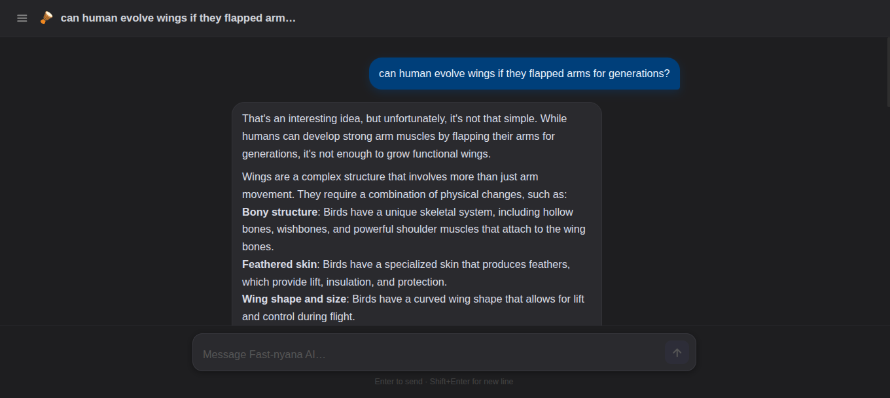
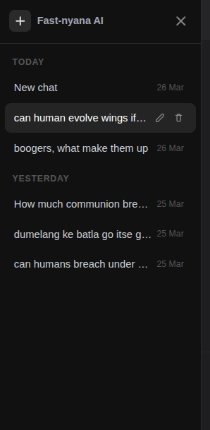
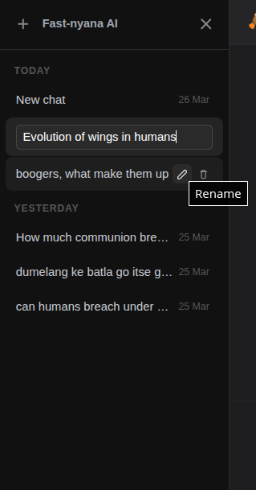
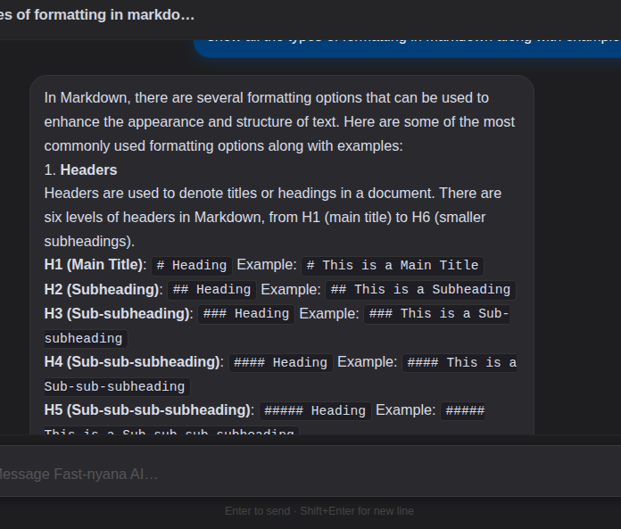

<div align="center">


<br/>

**A full-stack AI chat application with persistent conversation history, a collapsible sidebar, and context-aware responses powered by the Hugging Face Inference API.**

<br/>

[](https://react.dev/)
[](https://vitejs.dev/)
[](https://expressjs.com/)
[](https://nodejs.org/)
[](https://huggingface.co/)
[](LICENSE)

</div>

---

## ✨ Features at a glance

| Feature | Description |
|---|---|
| 🧠 **Contextual memory** | Full conversation history is sent to the AI on every message — it remembers everything said in the current chat |
| 💾 **Persistent storage** | All chats are saved to `localStorage` and survive page refreshes — no database required |
| 📂 **Smart sidebar** | Chats are grouped by recency — *Today*, *Yesterday*, *This Week*, *This Month*, and older by month |
| ✏️ **Mutable titles** | Chat titles are auto-generated from your first message and can be renamed at any time |
| 🗓️ **Date stamps** | Every chat entry shows the date it was last updated |
| 🗑️ **Delete chats** | Remove individual conversations instantly |
| 📱 **Collapsible sidebar** | Hide the sidebar with one click for a distraction-free full-screen chat experience |
| ⬆️ **Fixed input bar** | The input stays pinned at the bottom — scroll through history without losing your place |
| ↩️ **Keyboard shortcuts** | `Enter` to send, `Shift+Enter` for a new line |
| 📝 **Markdown rendering** | AI responses render with full markdown — code blocks, bold, lists, and more |
| 🔄 **Streaming animation** | Responses appear character by character, just like a real typing effect |
| 🩺 **Health endpoint** | `GET /health` shows server status, token load, and active model at a glance |

---

## 📸 Screenshots

**The main chat interface with sidebar open**
```
screenshots/01-chat-with-sidebar.png
```


---

**Sidebar collapsed — full focus mode**
```
screenshots/02-sidebar-collapsed.png
```


---

**Conversation grouped by date in the sidebar**
```
screenshots/03-sidebar-groups.png
```


---

**Renaming a chat inline**
```
screenshots/04-rename-chat.png
```


---

**Markdown rendering in assistant responses**
```
screenshots/05-markdown-response.png
```


---

## 🗂️ Project structure

```
fast-nyana-ai/
│
├── client/                        # React frontend (Vite)
│   ├── public/
│   └── src/
│       ├── App.jsx                # Main component — all UI, state, chat logic
│       ├── App.css                # All styles — dark theme, sidebar, bubbles
│       ├── Loading.jsx            # Spinner component used inside the send button
│       ├── index.css              # Tailwind import + global resets
│       └── main.jsx               # React entry point
│
├── server/                        # Node.js / Express backend
│   ├── index.js                   # API server — /ask + /health endpoints
│   ├── .env                       # Your secrets (never commit this)
│   └── .env.example               # Template — safe to commit
│
└── README.md
```

---

## 🚀 Getting started

### Prerequisites

- [Node.js](https://nodejs.org/) v18 or higher
- A free [Hugging Face](https://huggingface.co/) account

### 1 — Clone the repo

```bash
git clone https://github.com/your-username/fast-nyana-ai.git
cd fast-nyana-ai
```

### 2 — Get a Hugging Face token

1. Go to [huggingface.co/settings/tokens](https://huggingface.co/settings/tokens)
2. Click **New token** → choose **Fine-grained**
3. Under **Inference**, enable **"Make calls to the serverless Inference API"**
4. Click **Create token** and copy it

### 3 — Configure the server

```bash
cd server
cp .env.example .env
```

Open `server/.env` and fill it in:

```env
PORT=8000
HF_TOKEN=REPLACE_WITH_TOKEN
MODEL_NAME=meta-llama/Meta-Llama-3-8B-Instruct
```

> **Recommended free models** (all work with the free Inference API tier):
> | Model | Best for |
> |---|---|
> | `meta-llama/Meta-Llama-3-8B-Instruct` | General chat, reasoning |
> | `HuggingFaceH4/zephyr-7b-beta` | Instruction following, fast |
> | `mistralai/Mistral-7B-Instruct-v0.3` | Balanced, multilingual |

### 4 — Install dependencies

Open **two terminals** — one for the server, one for the client.

**Terminal 1 — Server:**
```bash
cd server
npm install
node index.js
```

You should see:
```
🚀  http://localhost:8000
🔑  token : loaded ✓
🤖  model : meta-llama/Meta-Llama-3-8B-Instruct
```

**Terminal 2 — Client:**
```bash
cd client
npm install
npm run dev
```

Open [http://localhost:5173](http://localhost:5173) in your browser. That's it.

---

## 🏗️ How it works

### Context-aware conversations

Every time you send a message, the client serialises the entire current conversation into a `history` array and sends it to the server alongside your new question:

```js
// Client → Server payload
{
  question: "What did I just ask you?",
  history: [
    { role: "user",      content: "My name is Lerato." },
    { role: "assistant", content: "Nice to meet you, Lerato!" }
  ]
}
```

The server prepends a system prompt and passes the full thread to the model:

```js
const messages = [
  { role: "system",    content: "You are Fast-nyana AI..." },
  ...history,           // every prior turn
  { role: "user",      content: question }  // new message
]
```

The model sees the whole conversation on every call — so it genuinely remembers names, earlier questions, and context, just like ChatGPT.

### Persistent chat storage

Chats are saved to the browser's `localStorage` after every state change. On page load, the app reads from `localStorage` first — so all your conversations are waiting exactly where you left them, with zero backend database needed.

```
localStorage["fastnyana_chats"] = [
  { id, title, messages: [...], createdAt, updatedAt },
  ...
]
```

### Architecture overview

```
Browser (React)
    │
    │  POST /ask  { question, history[] }
    ▼
Express Server (Node.js)
    │
    │  chatCompletion({ model, messages: [system, ...history, user] })
    ▼
Hugging Face Inference API
    │
    │  { choices[0].message.content }
    ▼
Express → React → streamed character by character to the UI
```

---

## 🛠️ Tech stack

### Frontend
| Package | Version | Purpose |
|---|---|---|
| React | 19 | UI framework |
| Vite | 8 | Dev server and bundler |
| Tailwind CSS | 4 | Utility styles |
| Axios | 1.13 | HTTP client |
| react-markdown | 10 | Renders markdown in AI responses |

### Backend
| Package | Version | Purpose |
|---|---|---|
| Express | 5 | HTTP server framework |
| @huggingface/inference | 4 | HF Inference API client (`InferenceClient`) |
| dotenv | 17 | Environment variable loading |
| cors | 2 | Cross-origin request handling |
| nodemon | 3 | Auto-restart during development |

---

## ⚙️ API reference

### `POST /ask`

Send a message and get an AI response.

**Request body:**
```json
{
  "question": "Explain recursion simply.",
  "history": [
    { "role": "user",      "content": "I am learning to code." },
    { "role": "assistant", "content": "That's great! What language?" }
  ]
}
```

**Success response `200`:**
```json
{
  "_status": true,
  "finalData": "Recursion is when a function calls itself..."
}
```

**Error response `500`:**
```json
{
  "_status": false,
  "message": "Model warming up — wait 20–30 s and try again"
}
```

---

### `GET /health`

Check server status without sending a real request.

```bash
curl http://localhost:8000/health
```

```json
{
  "status": "running",
  "token_loaded": true,
  "model": "meta-llama/Meta-Llama-3-8B-Instruct"
}
```

---

## 🐛 Troubleshooting

| Error | Cause | Fix |
|---|---|---|
| `ERR_CONNECTION_REFUSED` | Server isn't running | Run `node index.js` in the `server/` folder |
| `500 — Token rejected (401)` | Invalid HF token | Create a new token at huggingface.co/settings/tokens |
| `500 — Access denied (403)` | Token missing Inference permission | Enable **"Make calls to serverless Inference API"** on your token |
| `500 — Rate limited (429)` | Free tier limit hit | Wait 60 seconds and retry |
| `500 — Model warming up (503)` | Model cold-starting on HF servers | Wait 20–30 seconds and retry |
| `HF_TOKEN: MISSING ✗` in terminal | `.env` not configured | Copy `.env.example` → `.env` and add your token |
| Chats disappear on refresh | `localStorage` cleared | Open DevTools → Application → Local Storage → check `fastnyana_chats` |

---

## 🔮 Potential future features

Here's a prioritised list of features that would take this project to the next level:

### High impact, relatively straightforward
- [ ] **Light / dark mode toggle** — a simple CSS variable swap with a sun/moon button in the header
- [ ] **Export chat** — download the current conversation as a `.txt` or `.md` file
- [ ] **Copy message button** — one-click copy on any individual bubble
- [ ] **Regenerate response** — re-roll the last AI reply without re-typing the question
- [ ] **Stop generation** — abort an in-progress response mid-stream
- [ ] **Character count / token estimator** — show approximate token usage in the input bar

### Meaningful UX upgrades
- [ ] **Search conversations** — fuzzy search across all chat titles and message content in the sidebar
- [ ] **Pin important chats** — pin frequently used conversations to the top of the sidebar
- [ ] **Chat folders / tags** — organise chats into custom collections (e.g. "Work", "Personal", "Code")
- [ ] **Mobile responsive layout** — sidebar as a drawer overlay on small screens
- [ ] **Swipe to delete on mobile** — swipe a sidebar item left to reveal a delete button

### AI capability upgrades
- [ ] **System prompt editor** — let the user customise the AI's persona per chat via a settings panel
- [ ] **Model switcher** — dropdown in the header to change the active model per conversation
- [ ] **Temperature / creativity slider** — expose the `temperature` parameter as a simple UI control
- [ ] **Image input support** — upload an image and ask questions about it (multimodal models)
- [ ] **Voice input** — speak your message using the Web Speech API

### Backend & data features
- [ ] **User authentication** — sign-in with GitHub or Google; chats stored per user account
- [ ] **Cloud sync** — replace `localStorage` with a real database (Supabase, PlanetScale, or MongoDB Atlas) so chats sync across devices
- [ ] **Conversation sharing** — generate a shareable read-only link to any conversation
- [ ] **Chat import / export (JSON)** — full backup and restore of all conversations
- [ ] **Usage analytics dashboard** — track number of messages, tokens used, most active days

### Developer experience
- [ ] **Docker Compose setup** — one command to spin up both client and server
- [ ] **Automated tests** — unit tests for the helper functions, integration tests for the `/ask` endpoint
- [ ] **CI/CD pipeline** — GitHub Actions workflow to lint, test, and deploy on every push
- [ ] **Environment config UI** — a setup wizard on first launch that walks through adding the HF token

---

## 🤝 Contributing

Contributions are welcome! To get started:

1. Fork the repository
2. Create a feature branch: `git checkout -b feat/your-feature-name`
3. Commit your changes: `git commit -m "feat: add your feature"`
4. Push to your fork: `git push origin feat/your-feature-name`
5. Open a Pull Request

Please keep PRs focused — one feature or fix per PR makes review much faster.

---

## 📄 License

MIT — see [LICENSE](LICENSE) for details. Use it, modify it, ship it.

---

<div align="center">

Built with 🪘 by someone who wanted a chatbot that actually remembers things.

**[⬆ Back to top](#)**

</div>
